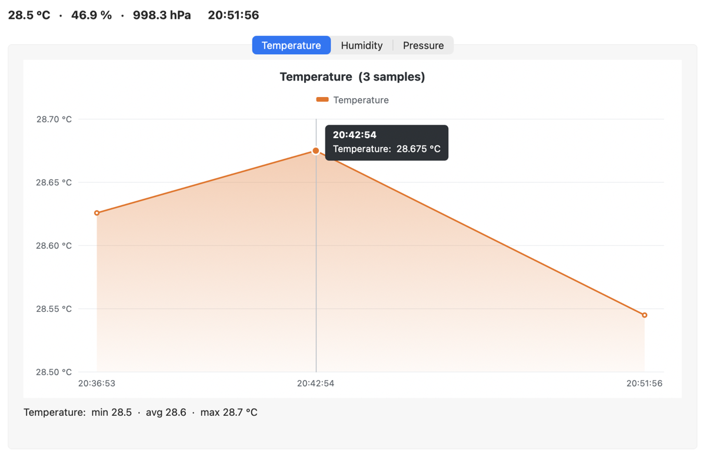
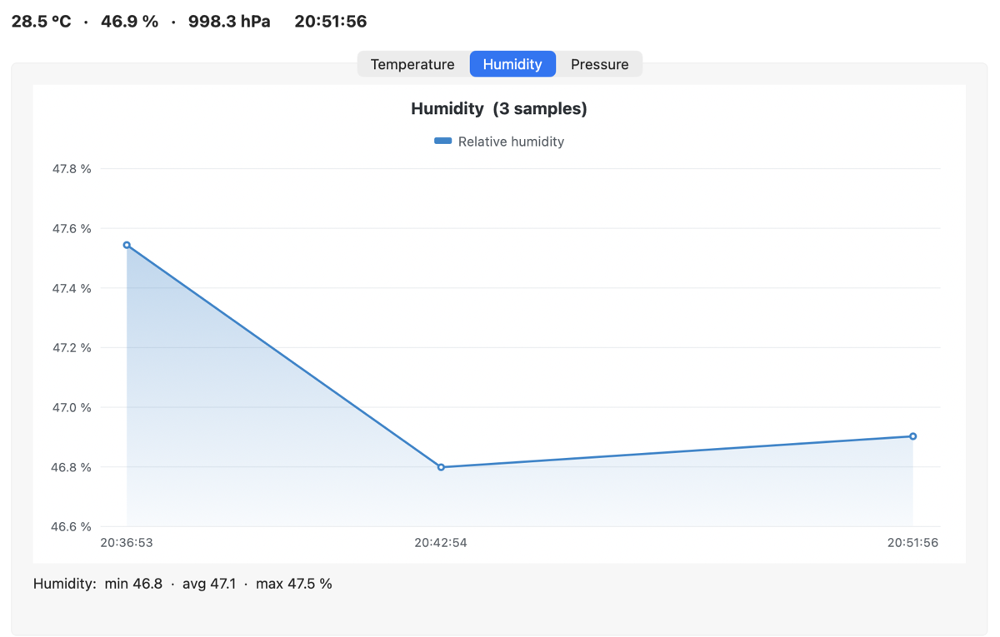
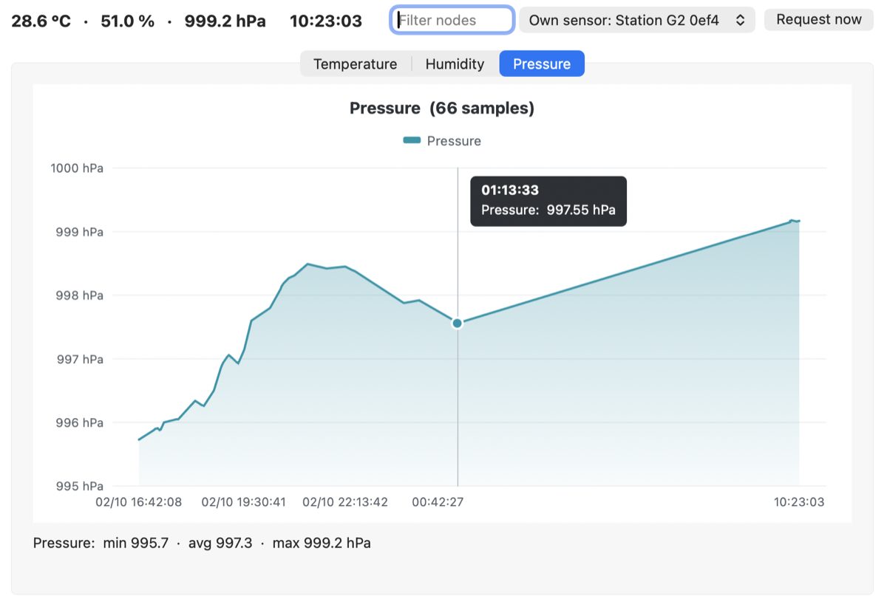

# Sensor Dashboard

A desktop dashboard, written entirely in Xojo, that follows environment sensors from three kinds of sources. It charts their readings live, stores every reading in SQLite, and exports each source to CSV and PNG.

| Source | What it reads | How |
|---|---|---|
| **Meshtastic MQTT** | Telemetry uploaded by a gateway node to an MQTT broker: temperature, humidity and pressure, plus the radio's RSSI and SNR | MQTT 3.1.1, decryption with the channel keys, the same JSON as the official Meshtastic MQTT converter |
| **M5Stack AQI** | An M5Stack Air Quality device (SEN55 + SCD40) through M5Stack's cloud: temperature, humidity, VOC, CO₂, PM1.0 / 2.5 / 4.0 / 10.0 | HTTPS, `ezdata2.m5stack.com` |
| **Meshtastic device** | A node's own environment sensor (e.g. a BME280 / BME680): temperature, humidity, pressure | The node's client API, over **TCP** (nodes on WiFi or Ethernet) or **USB serial** |

There are no plugins, no Python and no external tools. The Meshtastic parts use the [MQTT_Xojo](https://github.com/Kongduino/MQTT_Xojo) library, which is included in `Library/`.

## Screenshots

A Meshtastic node's own BME680, followed over USB. At the top, the latest values; under each chart, min / avg / max. The value under the mouse shows in a box, and samples sit at their real time, so the 6- and 9-minute gaps here keep their width.



<p>
  
  
</p>

## Contents

- [Screenshots](#screenshots)
- [Requirements](#requirements)
- [Getting started](#getting-started)
- [Sources](#sources)
- [Charts, data and export](#charts-data-and-export)
- [Where things are kept](#where-things-are-kept)
- [Repository layout](#repository-layout)
- [Limitations](#limitations)
- [License](#license)

## Requirements

- Xojo 2026 Release 2.1 or later (desktop project, text format)
- Developed and tested on macOS. Xojo builds for Windows and Linux too, but those builds haven't been tested.
- One or more sources, depending on what you want to follow:
  - **MQTT:** a broker that a Meshtastic gateway uploads to, with the gateway's MQTT uplink enabled
  - **M5Stack AQI:** a device that uploads to M5Stack's cloud, and its ID (its MAC address)
  - **Meshtastic device:** a node reachable over the network (port 4403) or connected over USB

## Getting started

1. Open `Sensor_Dashboard.xojo_project` in Xojo and run it.
2. The **Data Sources** window opens. Pick a tab (MQTT, M5 AQI or Meshtastic), fill in the fields, and press **Add**.
3. Each source opens its own window with its charts. It's also added to the list on the left:
   - **double-click** a row to bring its window to the front
   - **right-click** a row for **Export Data** or **Close Source**

The fields are remembered between runs (see [Where things are kept](#where-things-are-kept)).

## Sources

### Meshtastic MQTT

| Field | Meaning |
|---|---|
| Broker | Host name, or `host:port` (default port 1883, no TLS) |
| Root topic | The gateway's MQTT root topic, e.g. `msh/EU_868` |
| Node ID | The **gateway's** node ID (`aabbccdd` or `!aabbccdd`). The feed subscribes to `<root>/2/e/+/!<id>` |
| Username, Password | Broker login, if needed |
| Keys | Channel keys, if your channels don't use the default key (see below) |

The window charts temperature, humidity, pressure and RSSI / SNR. Its title shows the connection state: *connected*, *reconnecting*, *refused: bad username or password*… It reconnects on its own if the broker drops the connection.

**Channel keys.** Packets are decrypted with the channel key (PSK). By default every channel is tried with the default key, `AQ==`. For a channel with its own key, fill in **Keys**:

- `MyChannel=1PG7OiApB1nwvP+rz05pAQ==`: the channel name as it appears in the MQTT topic, `=`, and the key as the Meshtastic app shows it (base64; hex works too)
- several channels, separated by `;`: `MyChannel=…; Other=…`
- a key **without** a channel name is used for every channel not listed: `MyChannel=…; AQ==`

The Password and Keys fields are masked, with a **Show** button to check what you typed.

**What gets charted:** environment telemetry that reaches the broker through the gateway. A node sends it every *environment update interval*, 30 minutes by default. The node must have **environment measurement enabled** in its telemetry settings; without it, the sensor is never read. A reply to a telemetry *request* is a PKI direct message to the node that asked, so it can't be read here.

### M5Stack AQI

| Field | Meaning |
|---|---|
| AQI ID | The device's ID: its MAC address, 12 hex digits |

The first reading is fetched in the background; the window opens with it, titled with the device's nickname. After that, the cloud is checked every minute, and a reading is added only when the device has uploaded a new one. Devices typically upload every 10 minutes. The window charts temperature and humidity (SEN55 and SCD40), CO₂, the VOC index and particulate matter.

### Meshtastic device

| Tab | Fields |
|---|---|
| Network | The node's IP address or host name, and its port (4403) |
| USB | The serial port (the menu lists the ports; the first USB port is preselected) |

The app connects to the node the way the Meshtastic apps do: no broker, no keys, since the node decrypts its packets itself. The window is titled with the node's name and ID, and charts the **node's own sensor**: temperature, humidity and pressure. A connected node sends its sensor readings to the app **every minute**, independently of its broadcast interval on the mesh. If the node drops off (a reboot, WiFi loss), the window tries again every 30 seconds.

Only one window per node: a node has a single queue towards its clients, so two connections would share its readings. Adding a node that's already followed shows which connection follows it. While the app holds the USB port, no other program (the Meshtastic CLI, for example) can use it.

## Charts, data and export

- **One chart per quantity** (temperature, humidity, pressure, CO₂, VOC, PM, radio), each with a Y axis fitted to its values, the value and time under the mouse, and the same colour for a quantity in every window, in light and dark mode.
- Each window shows the **latest values** at the top, and **min / avg / max** under each chart, over the samples shown.
- **The X axis is a time axis:** each sample sits at the time it was taken, so gaps keep their real width. A reconnect, a node that sent nothing for an hour or a device that uploads every 10 minutes all show as such, instead of being squeezed to one step. The labels under the chart are the samples' times of day (`HH:MM` or `HH:MM:SS`), thinned out when they would overlap; the latest is always shown.
- Charts keep the last 100 samples of each source.
- **Every reading is stored** in SQLite (`records.sqlite`, table `telemetry`) with its source type, session, time, node or device ID and the full payload as JSON. Source types: `1` M5 AQI, `2` Meshtastic MQTT, `3` Meshtastic device.
- Each run of the app is a **session**, with its own folder `Session_<id>/` holding `Event_Log.txt`, a log of everything the app did: connections, every packet received, every value charted.
- **Export Data** (right-click a source) writes that source's readings for the current session, plus its charts as PNG, into the session folder:

| Source | Files |
|---|---|
| MQTT | `MQTT_<gateway>.csv`, `MQTT_<gateway>_Temperature.png`, `_Humidity.png`, `_Pressure.png`, `_RSSISNR.png` |
| M5Stack AQI | `AQI_<device>.csv`, `AQI_<device>_Temperature.png`, `_Humidity.png`, `_CO2.png`, `_VOC.png`, `_PM.png` |
| Meshtastic device | `DEV_<node>.csv`, `DEV_<node>_Temperature.png`, `_Humidity.png`, `_Pressure.png` |

All three exports write the same kind of CSV: `;` as separator, one row per reading, oldest first, and these columns:

| Source | Columns |
|---|---|
| MQTT | `timestamp`, `node` (the sender, `!aabbccdd`), `gateway`, `rssi`, `snr`, then one column per value |
| M5Stack AQI | `timestamp`, `device` (its 12-digit ID), then one column per value (`sen55_temperature`, `scd40_co2`…) |
| Meshtastic device | `timestamp`, `node`, then one column per value |

The value columns cover every key that appears in the session's readings, so a reading that lacks one, or a packet without radio values, leaves an empty cell.

## Where things are kept

| What | Where |
|---|---|
| Setup fields (broker, IDs, password, keys, last serial port) | `~/Library/Application Support/Sensor_Dashboard/settings.json` on macOS (the application data folder on other systems). Readable by your account only: it holds the broker password and channel keys in plain text. It's outside the project, so it can't end up in the repository. |
| Database | `records.sqlite`, in the same folder as `settings.json` (it used to be in `/tmp/Sensor_Dashboard`; a database left there is copied over once) |
| Event logs and exports | `Session_<id>/`, in the folder the app runs from (next to the built app, or next to the project when run from Xojo) |

## Repository layout

```
Sensor_Dashboard.xojo_project   the project (open this in Xojo)
SetupWindow.xojo_window         the Data Sources window: source list and the three tabs
MQTTwindow.xojo_window          a Meshtastic MQTT feed
M5AQIwindow.xojo_window         an M5Stack AQI device
MeshtasticWindow.xojo_window    a Meshtastic node over TCP or USB
Module1.xojo_code               session, database, event log, exports, settings, AQI parsing
SensorChart.xojo_code           the chart control (a DesktopCanvas): time axis, fitted Y axis, gradient, hover values
SensorSeries.xojo_code          one series of a SensorChart
ChartLook.xojo_code             colours per quantity, series helpers, min / avg / max
App.xojo_code, MainMenuBar.xojo_menu, Build Automation.xojo_code
Library/                        MQTT_Xojo's library (MQTT client, protobuf, Meshtastic decoding and
                                crypto, MeshDeviceLink), a copy of github.com/Kongduino/MQTT_Xojo/Library
docs/screenshots/               the README's screenshots
LICENSE                         GPL-3.0
```

`Library/` is kept identical to MQTT_Xojo's. Fixes to the library go there first, then are copied here.

## Limitations

- MQTT feeds connect without TLS, and on port 1883 unless you give `host:port`. MQTT_Xojo supports TLS, but the dashboard doesn't expose it yet.
- An MQTT feed follows one gateway. If that gateway also uploads other nodes' environment telemetry, those readings are charted in the same window.
- All MQTT feeds share one table of channel keys: two feeds that give the same channel name different keys overwrite each other.
- The RSSI / SNR chart stays empty for a gateway's own telemetry: a node doesn't measure the signal of its own packets.
- Charts show the current session only; earlier sessions are in the database, not in the charts.

## License

Copyright (C) 2020-2026 Kongduino

This program is free software: you can redistribute it and/or modify it under the terms of the GNU General Public License as published by the Free Software Foundation, either version 3 of the License, or (at your option) any later version. See [LICENSE](LICENSE).

It includes the [MQTT_Xojo](https://github.com/Kongduino/MQTT_Xojo) library (`Library/`), also under GPL-3.0.
